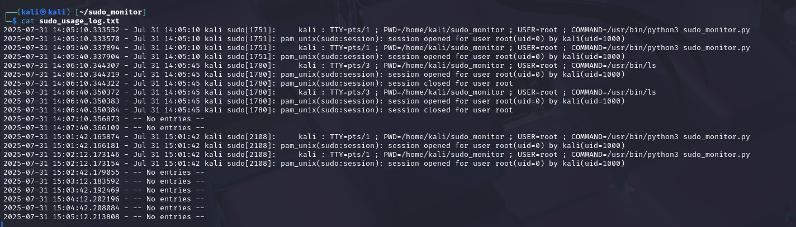

# Assignment 14: Sudo Usage Logging

## Objective
Monitor and log all uses of `sudo` every 30 seconds on Kali Linux to detect and record administrative privilege usage for security auditing.

## Methodology
1. **Script Creation**  
   - Wrote `sudo_monitor.py` in Python 3.
   - In a 30 s loop, ran:
     ```
     journalctl _COMM=sudo --since=-1min
     ```
     via `subprocess.run(..., shell=True)` to fetch the last minute’s sudo entries.
   - Parsed each non-empty line, prepended the current timestamp, and appended to `sudo_usage_log.txt`.  
2. **Execution**  
   - Launched the script with:  
     ```bash
     sudo python3 sudo_monitor.py
     ```
   - In a separate terminal, triggered sudo commands (e.g. `sudo ls`) to generate log entries.
3. **Verification**  
   - After ~30 s, stopped the script with `Ctrl+C`.
   - Inspected `sudo_usage_log.txt` to confirm entries.

## Findings
- Captured both the **invocation** and **session** events of `sudo`.
- Recorded details include **username**, **TTY**, **working directory**, **target user**, and **command**.
- The monitor reliably logs every new sudo attempt within each 30 s window.

## Screenshot


## Code
Access the code [here](code.py)
